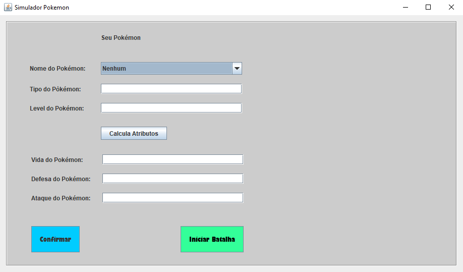
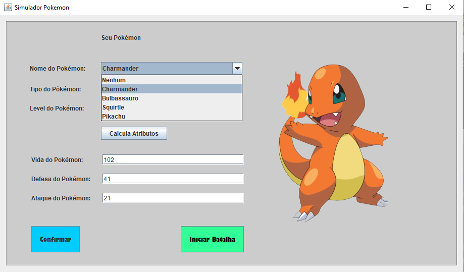
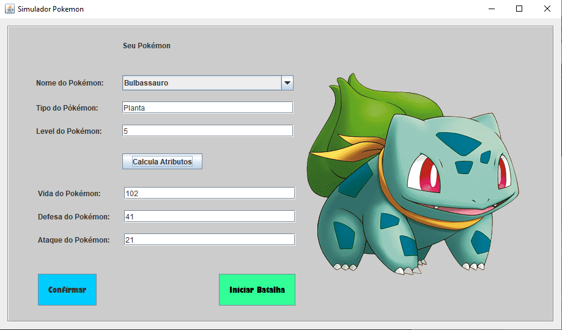
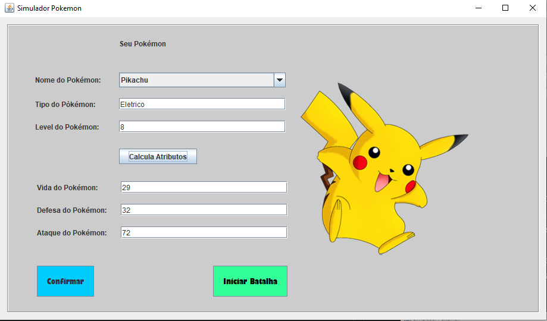

# __Simulador de Criação e Batalhas Pokémon__
  

O projeto consiste em permitir ao jogador criar seus próprios Pokémon, atribuindo a eles um tipo e um level.

## __Telas do Projeto__

Tela principal do projeto:

  

Essa tela possui:
- Labels com os títulos dos campos.
- Uma combobox para seleção do Pokemon.
- Campos de texto para serem preenchidos com os valores dos Pokemon.
- Um botão para calcular os atributos dos Pokemon.
- Um botão para confirmar a criação de um Pokemon.
- Um botão para Iniciar as batalhas.

Selecionando um Pokemon:

Na tela acima, é possível selecionar um Pokemon pela combobox e iniciar a atribuição dos valores referentes a ele (tipo, level, etc).

A imagem do Pokemon aparece de forma automática conforme o usuário seleciona um dos Pokemon já existentes na combobox:

E cada tipo de Pokemon pode possuir diferentes atributos de acordo com o seu level e tipo:

As batalhas e o cadastro dos Pokemon ainda se encontram em fase de desenvolvimento!

Autor:   
Matheus Avilla Vial  
Facens - Análise e Desenvolvimento de Sistemas